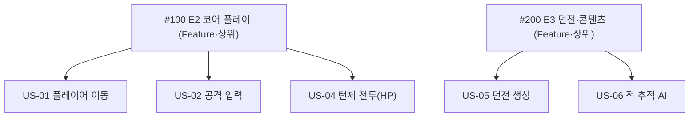

# 🟥 Redmine · 4단계 — 상위/하위 이슈로 WBS

> 🎯 **개요** — Redmine엔 "에픽"이란 말이 없지만, **상위 이슈 아래 하위 이슈**를 두면 똑같이 **WBS**(일을 큰 것 → 작은 것으로 쪼갠 구조)가 됩니다.

🎬 상황 · 일을 구조로
<ul>
<li>이슈를 평면으로 쭉 쌓으니 30개만 넘어도 길을 잃습니다.</li>
<li>"코어 플레이"라는 큰 덩어리 아래 작은 작업들을 묶고 싶습니다.</li>
<li><b>Parent task</b> 한 칸이면 계층이 생깁니다.</li>
</ul>

📍 [← 3단계](Step3.md) · [5단계 →](Step5.md)

---

## A. 상위 이슈(에픽 역할) 먼저 만들기

큰 묶음을 **상위 이슈**로 올립니다. 트래커는 `Feature`로 둡니다.

1. **`New issue`** → Tracker `Feature` · Subject `E2 코어 플레이` → **Create**
2. 같은 방식으로 `E3 던전·콘텐츠` 도 만듭니다

> 🙋 상위 이슈는 **묶음 역할**입니다. 여기에 직접 작업하지 말고, 실제 작업은 아래 하위 이슈에 둡니다.

## B. 하위 이슈 — `Parent task` 한 칸이 핵심

1. **`New issue`** → Subject `US-01 플레이어 이동`
2. **`상위 작업`(Parent task)** 칸에 `E2 코어 플레이` 지정 ← **이 한 칸이 계층을 만듭니다**
3. 같은 방식으로 배치합니다:

| 하위 이슈 | 상위(Parent) |
|---|---|
| US-01 플레이어 이동 · US-02 공격 입력 · US-04 턴제 전투(HP) | E2 코어 플레이 |
| US-05 던전 생성 · US-06 적 추적 AI | E3 던전·콘텐츠 |

> ✅ 상위 이슈를 열면 아래에 **하위 이슈(Subtasks) 목록**과 **진행률 합계**가 보입니다 = WBS 완성.

## C. 진행률이 자동으로 굴러 올라온다

하위 이슈에 **`% Done`(진행률)** 을 넣으면, 상위 이슈의 진행률이 **자동 평균**으로 계산됩니다. (예: 하위 3개가 60·30·0% → 상위 약 30%)

> 💡 `관리자 → 설정 → 이슈 추적`에서 "상위 이슈 값을 하위에서 계산"이 켜져 있으면, 상위의 날짜·진행률을 따로 손대지 않아도 하위가 굴려 올려줍니다.

---

## 🎮 현장 감각 — 게임 PM은 이렇게

> **Pixel Dungeon 맥락** 
> Redmine엔 '에픽'이라는 말이 없지만, 상위 이슈 아래 하위 이슈를 두면 똑같이 WBS가 됩니다. 
> 핵심은 하위 이슈의 'Parent task' 한 칸을 지정하는 것입니다. 
> 도구 이름이 달라도 "큰 것을 작은 것으로 쪼갠다"는 원리는 어디서나 같습니다.

**⚠️ 흔한 실수**
- Parent task를 안 지정함 → 평면 목록이 되어 WBS가 안 됩니다.
- 상위 이슈에 직접 작업을 함 → 상위는 **묶음**, 실제 작업은 **하위**에 둡니다.

**🎤 면접 한 줄**
> *"**상위/하위 이슈로 WBS**를 구성해, 큰 기능을 개발 가능한 단위까지 분해하고 진행률을 자동 집계했습니다."*

---

## ✅ 확인

- [ ] 상위 이슈 2개(E2·E3)가 있다
- [ ] 하위 이슈에 **Parent task**를 지정했다
- [ ] 상위 이슈를 열면 하위 목록·진행률 합계가 보인다

---

👉 다음: **[5단계 · 버전(마일스톤) & 로드맵](Step5.md)**
