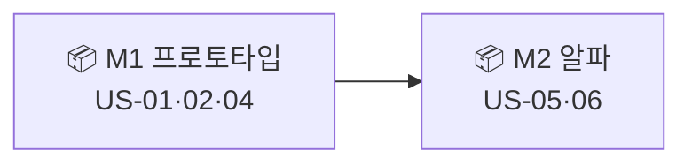

# 🟥 Redmine · 4단계 — 버전(마일스톤) + 로드맵

> 🎯 이번 단계 목표: **버전을 만들어 마일스톤으로 쓰고, 로드맵으로 진척을 본다.**
> 📍 [← 3단계](Step3.md) · 다음 [5단계 →](Step5.md)

---

Redmine의 **Version = 마일스톤** 입니다.

## A. 버전 만들기

1. 프로젝트 **`Settings` → `Versions` → `New version`**
2. `M1 프로토타입`(Due date 7/17), `M2 알파`(7/31) 생성

## B. 이슈에 연결 + 로드맵 보기

1. 각 이슈를 열어 **`Target version`** 칸에 버전 지정
   (US-01·02·04 → M1, US-05·06 → M2)
2. 상단 **`Roadmap`** 탭 → 버전별 진척(완료/전체, %)이 자동 집계됩니다

> 🖼️ 공식 스크린샷 자리 — Roadmap

---

## ✅ 확인

- [ ] 버전 M1·M2가 있다
- [ ] 이슈에 Target version이 연결돼 Roadmap에 진척%가 보인다

---

👉 다음: **[5단계 · 내장 간트](Step5.md)**
