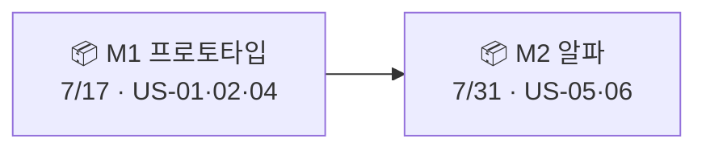

# 🟥 Redmine · 5단계 — 버전(마일스톤) & 로드맵

> 🎯 **개요** — Redmine의 **버전(Version) = 마일스톤**입니다. 이슈를 버전에 연결하면 **로드맵(Roadmap)** 이 버전별 진척을 자동으로 집계합니다.

🎬 상황 · 언제 무엇을 낼까
<ul>
<li>대표가 묻습니다. "프로토타입은 언제 나와요? 알파는요?"</li>
<li>출시 지점(마일스톤)을 정하고, 어떤 작업이 거기 들어가는지 묶어야 합니다.</li>
<li>Redmine에선 <b>버전</b>이 그 역할을 합니다.</li>
</ul>

📍 [← 4단계](Step4.md) · [6단계 →](Step6.md)

---

## A. 버전 만들기

1. **`프로젝트 설정(Settings) → 버전(Versions) → 새 버전`(New version)**
2. 두 개를 만듭니다:

| 버전 | 마감일(Due date) | 뜻 |
|---|---|---|
| **M1 프로토타입** | 7/17 | 핵심 플레이가 도는 첫 빌드 |
| **M2 알파** | 7/31 | 콘텐츠가 붙은 내부 테스트판 |

> 🙋 **마감일을 꼭 넣으세요.** 마감이 있어야 로드맵·간트에 기준선이 생깁니다.

## B. 이슈에 버전 연결하기

각 이슈를 열어 **`대상 버전`(Target version)** 칸을 채웁니다:

| 버전 | 이슈 |
|---|---|
| M1 프로토타입 | US-01 · US-02 · US-04 |
| M2 알파 | US-05 · US-06 |

## C. 로드맵으로 진척 보기

상단 **`로드맵`(Roadmap)** 탭을 엽니다.

- 버전별로 **완료/전체 이슈 수**와 **진행률 %** 가 자동 집계됩니다.
- 버전 이름을 누르면 그 버전에 속한 이슈 목록이 펼쳐집니다.
- **따로 보고서를 만들지 않아도** "M1이 몇 % 됐는지"가 한눈에 보입니다.

> 💡 버전 상태를 `잠금(locked)`·`닫힘(closed)`으로 바꾸면, 끝난 마일스톤을 새 이슈 연결 대상에서 빼 깔끔하게 관리할 수 있어요.

---

## 🎮 현장 감각 — 게임 PM은 이렇게

> **Pixel Dungeon 맥락** 
> Redmine에선 'Version'이 곧 마일스톤(M1·M2)입니다. 
> 이슈를 버전에 연결해 두면, 로드맵이 버전별 진척률을 자동으로 계산해 줍니다. 
> 따로 보고서를 만들지 않아도 "M1이 몇 % 됐는지"가 한눈에 보입니다.

**⚠️ 흔한 실수**
- 이슈에 **Target version을 안 검** → 로드맵이 비어 보입니다.
- 버전 **마감일을 비움** → 일정 기준이 사라져 간트도 흐려집니다.

**🎤 면접 한 줄**
> *"**버전을 마일스톤**으로 삼고 이슈를 연결해, **로드맵**으로 진척을 자동 집계했습니다."*

---

## ✅ 확인

- [ ] 버전 M1·M2가 있고 **마감일**이 들어 있다
- [ ] 이슈에 **Target version**을 연결했다
- [ ] 로드맵에 버전별 **진척 %** 가 보인다

---

👉 다음: **[6단계 · 내장 간트 차트](Step6.md)**
