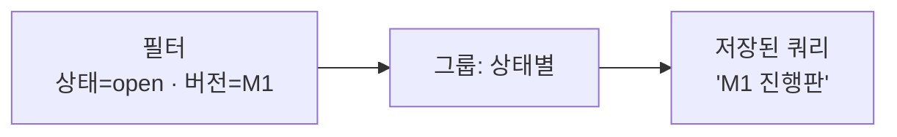

# 🟥 Redmine · 7단계 — 사용자 정의 쿼리 (필터·정렬·그룹)

> 🎯 **개요** — 이슈가 쌓이면 눈으로 못 찾습니다. Redmine의 **필터·정렬·그룹**으로 원하는 것만 추리고, 자주 쓰는 조합은 **저장된 쿼리**로 한 번 클릭에 부릅니다.

🎬 상황 · 이슈가 수십 개
<ul>
<li>"이번 M1에서 아직 안 끝난 것만", "내게 배정된 버그만" 보고 싶습니다.</li>
<li>매번 눈으로 찾는 대신 <b>조건(필터)</b>으로 거릅니다.</li>
<li>자주 보는 조합은 <b>저장</b>해 클릭 한 번에 엽니다.</li>
</ul>

📍 [← 6단계](Step6.md) · [8단계 →](Step8.md)

---

## A. 필터로 추리기

상단 **`이슈`(Issues)** 탭 → 위쪽 **`필터`(Filters)** 영역에서 조건을 더합니다.

1. **`필터 추가`(Add filter)** 드롭다운에서 기준 선택 → 값 지정 → **`적용`(Apply)**
2. 자주 쓰는 필터:

| 필터 | 예시 | 쓰임 |
|---|---|---|
| **상태(Status)** | `open`(미완료) | 안 끝난 것만 |
| **트래커(Tracker)** | `Bug` | 버그만 |
| **대상 버전(Target version)** | `M1 프로토타입` | 이번 마일스톤만 |
| **담당자(Assignee)** | `<< me >>`(나) | 내 일만 |
| **우선순위(Priority)** | `High` 이상 | 급한 것만 |

> 🙋 조건은 **여러 개를 겹쳐** 쓸 수 있어요. 예: `상태=open` **＋** `대상 버전=M1` **＋** `우선순위=High` → "M1에서 아직 안 끝난 급한 일".

## B. 정렬·그룹·표시 열

필터 아래 **`옵션`(Options)** 을 펼치면:

- **정렬(Sort)**: 우선순위·마감일 순 등으로 줄 세우기.
- **그룹(Group results by)**: 기준별로 묶어 **소계**까지 보여줍니다.
- **표시 열(Columns)**: 목록에 보일 칸(담당·버전·진행률 등) 고르기.

### 🗂️ 그룹 = 칸반 흉내내기

Redmine 기본엔 드래그 칸반이 없지만, **`Group results by → 상태(Status)`** 로 묶으면 **상태별 칼럼처럼** 한 화면에 모입니다(New / In Progress / Resolved …). 칸반 대용으로 충분히 쓸 만해요.

## C. 저장된 쿼리 (My / 공용)

마음에 드는 필터+정렬+그룹 조합을 만들었다면 오른쪽 위 **`저장`(Save)**:

1. 이름 예: `M1 진행판`, `내 미해결 버그`
2. **공개 범위**: 나만(비공개) / 프로젝트 멤버 공용 선택
3. 저장하면 왼쪽 사이드바에서 **클릭 한 번**에 그 화면을 다시 엽니다.

> 💡 PM의 하루는 보통 저장된 쿼리 2~3개로 시작합니다: "오늘 내 일", "이번 버전 미해결", "급한 버그".

---

## 🎮 현장 감각 — 게임 PM은 이렇게

> **Pixel Dungeon 맥락** 
> 출시가 가까울수록 "지금 막는 게 뭔지"를 빠르게 봐야 합니다. 
> 저장된 쿼리 하나면 스탠드업에서 그 화면만 띄우고 회의가 끝납니다. 
> 칸반이 없어도 '상태별 그룹'으로 한 화면에 흐름을 펼칠 수 있습니다.

**⚠️ 흔한 실수**
- 매번 손으로 같은 필터를 다시 검 → 한 번 만들고 **저장**하세요.
- 필터를 너무 많이 겹쳐 결과가 0 → 조건을 하나씩 빼며 확인합니다.

**🎤 면접 한 줄**
> *"**필터·그룹·저장된 쿼리**로 '이번 마일스톤 미해결'·'내 버그' 같은 운영 화면을 만들어 매일 점검했습니다."*

---

## ✅ 확인

- [ ] 필터를 2개 이상 겹쳐 원하는 이슈만 추렸다
- [ ] **상태별 그룹**으로 칸반처럼 펼쳐봤다
- [ ] 조합을 **저장된 쿼리**로 만들었다

---

👉 다음: **[8단계 · 시간 추적 & 이슈 관계](Step8.md)**
