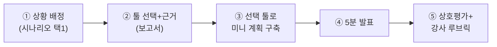

# 🏁 Day 5 — 캡스톤: 툴 선택 & 미니 프로젝트 계획

> **목표**: 4개 툴을 모두 경험한 지금, **상황에 맞는 툴을 근거와 함께 선택**하고, 그 툴로 미니 프로젝트 계획을 수립한 뒤 **발표**한다.
> **산출물(D5)**: 툴 선택 보고서 + 선택 툴의 미니 계획 + 5분 발표.

> PM의 진짜 실력은 "툴을 다루는 것"을 넘어 **"이 팀·이 상황엔 어떤 툴이 맞는가"를 판단하는 것**입니다. 오늘이 그 연습입니다.

---

## 1. 진행 흐름 (반나절~하루)



---

## 2. 상황 시나리오 (택1 또는 강사 배정)

각 상황은 **제약이 달라서 최적 툴이 달라집니다.** 정답은 하나가 아니며, **근거의 타당성**으로 평가합니다.

### 🅰 인디 2인 게임잼
- 팀: 개발1·아트1, 48시간 게임잼. 예산 0, 셋업은 5분 안에.
- 키워드: 속도, 단순함, 칸반.

### 🅱 정식 스튜디오 (20명, 6개월)
- 팀: 프로그래머·아티스트·기획·QA 다수. 스크럼, 스프린트 리포트·로드맵 필요. 예산 있음.
- 키워드: 백로그·스프린트·번다운·확장성·채용 호환성.

### 🅲 공공/보안 프로젝트 (예산 제약 + 사내 서버 필수)
- 팀: 외주 5명. 데이터는 **반드시 사내 서버**에, 라이선스 비용 불가. Gantt 보고 필요.
- 키워드: 오픈소스·자체호스팅·Gantt·비용 0.

### 🅳 크로스팀 캐주얼 게임 (기획+마케팅+외주)
- 팀: 기획·아트·외부 마케팅·QA. 비개발자 비중 높음, 일정 공유 중심, 직관적 UI 필요.
- 키워드: 쉬운 협업·다중 뷰·일정 공유.

> 권장 매칭(참고용, 절대답 아님): 🅰→Trello, 🅱→Jira, 🅲→Redmine, 🅳→Asana. **다른 선택도 근거가 좋으면 인정.**

---

## 3. 산출물 ① — 툴 선택 보고서

아래 템플릿을 채웁니다(A4 1장 분량).

```
# 툴 선택 보고서 — [상황 🅰/🅱/🅲/🅳]

## 1. 상황 요약 (3줄)
- 팀 구성 / 기간 / 핵심 제약:

## 2. 선택한 툴: ______
## 3. 선택 근거 (3가지 이상, 비교 우위로)
- (1) [제약]에 대해 [이 툴]은 …  / 다른 툴은 …라서 부적합
- (2) …
- (3) …

## 4. 이 툴의 약점과 보완책
- 약점: …  → 보완: (대체 기능 / 플러그인 / 병행 툴)

## 5. 탈락 툴 한 줄 평
- Trello/Jira/Asana/Redmine 중 선택하지 않은 것들의 탈락 이유
```

> 💡 좋은 보고서 = "왜 골랐나"보다 **"왜 다른 걸 안 골랐나"**가 분명한 보고서. 비교표([`02_Tool_Comparison_Matrix.md`](../00_Overview/02_Tool_Comparison_Matrix.md))를 근거로 인용하세요.

---

## 4. 산출물 ② — 선택 툴로 미니 계획

선택한 툴에서 **자신의 상황에 맞춘** 미니 프로젝트를 구축합니다(시나리오는 Pixel Dungeon Run을 재사용하거나 상황에 맞게 각색).

**최소 요구치**:
- [ ] 에픽/상위분류 **3개**
- [ ] 작업(스토리/카드/태스크/이슈) **6개** 이상 (담당·우선순위 포함)
- [ ] 마일스톤/버전 또는 스프린트 **1개**
- [ ] 그 툴의 **시그니처 기능 1개** 시연 (Trello=Butler / Jira=Sprint+Timeline / Asana=다중뷰 / Redmine=Gantt)

> 이미 Day1~4에서 만든 결과물을 발전시켜도 됩니다.

---

## 5. 산출물 ③ — 5분 발표

발표 구성(권장):
1. 상황 한 줄 (15초)
2. 선택 툴 + 핵심 근거 3가지 (2분)
3. 미니 계획 화면 시연 (2분)
4. 약점·보완책 + 한 줄 결론 (45초)

---

## 6. 상호평가 (동료 리뷰)

발표를 들은 동료는 아래 3개에 1~5점 + 코멘트:
- **근거 타당성**: 선택 이유가 상황 제약과 맞물리는가?
- **계획 완성도**: 미니 계획이 실제로 굴러갈 수준인가?
- **툴 이해도**: 시그니처 기능을 정확히 썼는가?

---

## 7. 평가 (강사)

[`90_Instructor/Assessment_Rubric.md`](../90_Instructor/Assessment_Rubric.md)의 캡스톤 루브릭으로 평가(전체 배점의 30%).

---

## 8. 과정 마무리 회고

- 4개 툴 중 **가장 손에 맞은 툴**과 이유
- 같은 작업(US-05 절차적 생성)이 4툴에서 어떻게 다르게 표현됐는지 한 줄
- 현업에 가면 **가장 먼저 깊게 파고 싶은 툴**과 이유

> 🎓 축하합니다. 이제 여러분은 *툴을 다룰 줄 알고, 툴을 고를 줄 아는* PM 지망생입니다.
