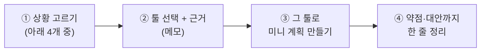

# 🏁 마무리 — 상황에 맞는 툴 고르기 (가이드)

> 툴들을 둘러봤다면(**트랙은 순서가 없으니** 꼭 다 해보지 않아도 괜찮아요), 한번쯤 **"이 상황엔 어떤 툴이 맞는가"를 스스로 판단**해 보세요. PM의 진짜 실력은 *툴을 다루는 것*을 넘어 **상황에 맞는 툴을 고르는 것**이니까요. 평가도 제출도 없습니다 — 직접 골라보고 근거를 정리하는 연습입니다.

---

## 1. 해보는 흐름



---

## 2. 상황을 골라보세요 (제약이 다르면 최적 툴도 다릅니다)

정답은 하나가 아닙니다. **근거가 상황과 맞물리는가**가 핵심입니다.

### 🅰 인디 2인 게임잼
- 개발1·아트1, 48시간. 예산 0, 셋업은 5분 안에. → 키워드: 속도·단순함·칸반.

### 🅱 정식 스튜디오 (20명, 6개월)
- 프로그래머·아티스트·기획·QA 다수. 스크럼, 스프린트 리포트·로드맵 필요. → 키워드: 백로그·스프린트·번다운·확장성.

### 🅲 공공/보안 프로젝트 (예산 제약 + 사내 서버 필수)
- 외주 5명. 데이터는 반드시 사내 서버, 라이선스 비용 불가, Gantt 보고 필요. → 키워드: 오픈소스·자체호스팅·간트·비용 0.

### 🅳 크로스팀 캐주얼 게임 (기획+마케팅+외주)
- 비개발자 비중 높음, 일정 공유 중심, 직관적 UI 필요. → 키워드: 쉬운 협업·다중 뷰·일정 공유.

> 참고 매칭(절대답 아님): 🅰→Trello, 🅱→Jira, 🅲→Redmine, 🅳→Asana. **다른 선택도 근거가 좋으면 맞습니다.**

> 🔧 **Jenkins는 이 선택지에 안 들어가요** — Jira·Asana·Trello·Redmine이 '할 일 관리' 툴이라 서로 *대안*이라면, [Jenkins](../06_Jenkins/Guide.md)는 '빌드 자동화(CI)' 도구라 **어느 팀이든 빌드가 필요하면 함께** 씁니다. "무엇 대신"이 아니라 "무엇에 더해"로 생각하세요.

---

## 3. 툴 선택 메모 (스스로 채워보기)

아래를 머릿속으로, 또는 간단히 적어보세요. (A4 반 장이면 충분)

```
# 상황: [🅰/🅱/🅲/🅲]
1) 핵심 제약 3가지:
2) 선택한 툴:
3) 선택 근거 (비교 우위로 3가지):
   - [제약]에 대해 [이 툴]은 …  / 다른 툴은 …라서 부적합
4) 이 툴의 약점과 보완책:
5) 안 고른 툴들의 탈락 이유 (한 줄씩):
```

> 💡 좋은 정리 = "왜 골랐나"보다 **"왜 다른 걸 안 골랐나"** 가 분명한 정리. 근거는 [툴 비교 문서](../00_Overview/02_Tool_Comparison_Matrix.md)에서 인용하세요.

---

## 4. 선택한 툴로 미니 계획 만들어보기

고른 툴에서, 그 상황에 맞춘 작은 계획을 직접 구성해 봅니다. ([Pixel Dungeon](../00_Overview/03_Game_Project_Scenario.md)을 재사용하거나 상황에 맞게 각색)

해보면 좋은 최소치:
- [ ] 에픽/상위분류 **3개**
- [ ] 작업 **6개** 이상 (담당·우선순위 포함)
- [ ] 마일스톤/버전 또는 스프린트 **1개**
- [ ] 그 툴의 **시그니처 기능 1개** (Trello=Butler / Jira=Sprint+Timeline / Asana=다중뷰 / Redmine=Gantt)

> 앞에서 만든 결과물을 발전시켜도 됩니다.

---

## 5. 스스로 마무리 점검

- [ ] 상황의 제약을 정확히 짚었다
- [ ] 비교 우위로 툴을 선택하고, 안 고른 툴의 이유도 말할 수 있다
- [ ] 그 툴의 약점과 보완책을 안다
- [ ] 그 툴로 최소한의 계획을 직접 만들 수 있다

---

## 6. 마지막 정리 (면접에서 빛나는 한마디)

이 가이드를 끝낸 당신은 이렇게 말할 수 있습니다:

> *"저는 Trello·Jira·Asana·Redmine을 직접 써봤고, **칸반은 Trello, 본격 스크럼·로드맵은 Jira, 무료 간트·자체호스팅은 Redmine, 비개발 직군 협업은 Asana** 처럼 상황에 맞춰 툴을 고를 줄 압니다."*

- 4개 툴 중 **가장 손에 맞은 툴**과 이유를 한 문장으로 정리해 두세요.
- 같은 작업(US-05 던전 생성)이 4툴에서 어떻게 다르게 표현됐는지 떠올려 보세요.

> 🎓 여기까지 왔다면, 당신은 *툴을 다룰 줄 알고, 툴을 고를 줄 아는* PM 지망생입니다.
