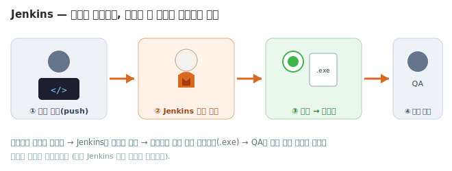

# 🟧 Jenkins 가이드 — 개요

> **내 컴퓨터에서 게임 빌드를 자동으로 찍어주는 도구**입니다. 다른 협업툴(Jira·Asana·Trello)이 "할 일을 관리"한다면, Jenkins는 **"코드가 바뀌면 게임을 자동으로 빌드"**해 줍니다. 프로그래머가 아니어도, 차근차근 따라오면 내 손으로 자동 빌드를 만들 수 있어요.
> 💳 무료(오픈소스) · 🧰 내 PC에 설치 · 🎮 Unity 빌드 자동화
> 💼 이 트랙에서 Jenkins의 **빌드 자동화 핵심**을 익힙니다 (설치 · Freestyle Job · 빌드 읽기 · Unity 자동 빌드 · 자동 트리거 · 산출물 보관 · 깨진 빌드 대응). "빌드는 QA가 매번 손으로 받지 않아도 된다"를 직접 구현해 봅니다.

---

## 🧩 Jenkins가 뭐예요?

게임을 한 번 "빌드"하려면 보통 프로그래머가 Unity를 열고, 메뉴를 누르고, 몇 분을 기다려 `.exe`를 만들어 QA에게 전달합니다. 하루에 몇 번씩 하면 번거롭고 실수도 생겨요("어제 빌드 어디 있죠?", "내 PC에선 됐는데…"). **Jenkins는 이 과정을 대신 해주는 "자동 빌드 집사"**입니다. 한 번 시켜두면 **사람이 안 눌러도** 알아서 빌드하고, 결과(성공/실패)와 실행파일을 보관해 줍니다.

| 단어 | 뜻 |
|---|---|
| **빌드(Build)** | 소스코드를 실제 실행파일(게임 `.exe`)로 만드는 것 |
| **CI/CD** | 코드가 바뀔 때마다 자동으로 빌드·테스트(하고 배포)하는 흐름 |
| **Job / Item (작업)** | "이렇게 빌드해라"를 적어둔 설정 한 묶음 |
| **Build Trigger (빌드 유발)** | "언제 빌드할지" (수동 클릭 · 주기 · 코드 올라오면) |
| **Artifact (산출물)** | 빌드가 만들어낸 결과물(`.exe` 등). Jenkins가 보관 |
| **빌드 결과 표시** | 성공·실패를 색깔 공으로 (보통 파랑/초록=성공, 빨강=실패) |

> 🔸 **CI/CD = "빌드 자동화"보다 넓은 말**입니다. "코드 올림 → 빌드 → 테스트 → 배포"로 이어지는 **자동 파이프라인** 전체를 뜻하고, 우리가 배우는 *빌드 자동화*는 그 첫 칸이에요. 이 트랙은 그 첫 칸을 직접 만들어 봅니다.

---

## 🎯 이 가이드를 끝내면

- [ ] Jenkins를 내 PC에 설치하고 `localhost:8080`으로 열 수 있다
- [ ] Freestyle Job을 만들어 "빌드"를 직접 돌리고, 성공/실패를 읽을 수 있다
- [ ] Unity 프로젝트를 명령어로 빌드해 `.exe`를 자동으로 뽑을 수 있다
- [ ] 사람이 안 눌러도 도는 자동 트리거를 걸고, 결과물을 QA에게 전달할 수 있다

---

## 📚 단계별로 배우기

**🟢 기초** — 설치하고, 빌드 한 번을 끝까지

| 단계 | 내용 |
|---|---|
| [**1단계 · Jenkins 설치하기**](Step1.md) | 내 PC에 띄우기 (관문!) |
| [**2단계 · 첫 Job & 첫 빌드**](Step2.md) | Freestyle Job → 성공 공 체험 |
| [**3단계 · 빌드 읽기**](Step3.md) | 콘솔·히스토리·성공/실패·작업공간 |

**🔵 실무** — 진짜 Unity 게임을 자동 빌드

| 단계 | 내용 |
|---|---|
| [**4단계 · Unity 빌드 준비**](Step4.md) | 빌드 스크립트 붙여넣기 · 명령어 이해 |
| [**5단계 · Jenkins로 Unity 빌드**](Step5.md) | 한 번에 `.exe`까지 자동으로 |
| [**6단계 · 자동 트리거**](Step6.md) | 사람이 안 눌러도 도는 빌드 |

**🟣 응용** — 운영·전달·대응

| 단계 | 내용 |
|---|---|
| [**7단계 · 산출물 보관·전달**](Step7.md) | Artifact로 QA에게 빌드 전달 |
| [**8단계 · 깨진 빌드 대응**](Step8.md) | 알림·대시보드·"빌드 깨짐" 문화 |
| [**9단계 · Git 연동 & 마무리**](Step9.md) | push→자동 빌드, QA 연결, 한계 |

- [**직접 해보기**](Practice.md) — 혼자 처음부터 자동 빌드 만들기

> 💡 연습용 프로젝트는 [Pixel Dungeon](../00_Overview/03_Game_Project_Scenario.md). 이 트랙은 **Unity가 이미 설치돼 있다고 가정**합니다. 1단계(설치)만 넘으면 나머지는 쉬워요.

---

## ⚠️ 시작 전 딱 두 가지

1. **Java가 필요해요** — Jenkins는 Java로 동작합니다. 1단계에서 함께 설치합니다 (겁먹지 마세요, 따라만 오면 됩니다).
2. **Unity가 설치돼 있어야 해요** — 5단계부터 진짜 Unity 빌드를 합니다. 이미 Unity로 간단한 프로젝트를 만들어 본 적이 있다면 충분합니다.

> 🔸 **"왜 클라우드가 아니라 내 PC에 까나요?"** → Jenkins는 **자체 호스팅** 도구라 내 PC(또는 회사 서버)에서 돕니다. 그래서 **내 PC에 깔린 Unity를 그대로** 불러 빌드할 수 있어, 라이선스 같은 골치 아픈 문제가 사라집니다. (Redmine을 직접 띄웠던 것과 같은 '자체 호스팅' 개념이에요.)

---

## 🎤 다 배우면 면접에서 이렇게

> *"Jenkins를 직접 설치해서 **Unity 프로젝트를 자동으로 빌드**하는 파이프라인을 만들어 봤습니다. 코드가 올라오면 **사람이 안 눌러도 빌드가 돌고**, 결과물(.exe)을 QA가 바로 받도록 했습니다. CI/CD가 왜 필요한지, 빌드가 깨지면 무엇을 멈춰야 하는지 PM 관점에서 설명할 수 있습니다."*

---

👉 준비됐으면 **[1단계 · Jenkins 설치하기](Step1.md)** 로 시작하세요.
