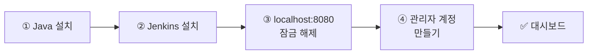

# 🟧 Jenkins · 1단계 — Jenkins 설치하기

> 🎯 **개요** — 다른 클라우드 툴은 "가입"만 하면 되지만, Jenkins는 **내 컴퓨터에 직접 띄웁니다.** 이 관문만 넘으면 나머지는 쉬워요. 프로그래머가 아니어도 따라만 오면 됩니다.

<div class="scenario">
<span class="who">🎬 상황 · 첫날 — 자동 빌드 담당이 되다</span>
<ul>
<li>QA가 말합니다. "매번 빌드 받느라 개발자한테 물어봐야 해요. 어제 빌드가 어디 있는지도 모르겠고요."</li>
<li>PM인 내가 <b>자동 빌드 서버(Jenkins)</b>를 띄워, 누구나 최신 빌드를 받게 하기로 합니다.</li>
<li>겁먹지 마세요 — <b>설치 마법사를 따라 클릭</b>하면 됩니다.</li>
</ul>
</div>

📍 [← 개요](Guide.md) · [2단계 →](Step2.md)

---

## 설치 흐름 한눈에



> 이 트랙은 **Windows 기준**으로 설명합니다. (Mac은 `brew install jenkins-lts`, 막히면 9단계 끝의 공식 문서 링크를 참고하세요.)

---

## A. Java 설치 (Jenkins의 연료)

Jenkins는 **Java**라는 언어로 동작해서, Java가 먼저 깔려 있어야 합니다.

1. **https://adoptium.net** 접속 → **Temurin JDK 21 (LTS)** 다운로드 (무료)
2. 받은 설치 파일 실행 → **계속 `다음`** 으로 기본 설치
   - 설치 중 **"Set JAVA_HOME"**(환경변수 설정) 옵션이 보이면 **체크**해 두면 편합니다.

> 🙋 이미 Java가 있는지 모르겠다면 그냥 설치하세요. 최신 버전이 하나 더 있어도 문제 없습니다.

## B. Jenkins 설치 (설치 마법사)

1. **https://www.jenkins.io/download/** 접속 → **Windows** 의 **LTS**(안정판) `.msi` 다운로드
2. 받은 `.msi` 실행 → 설치 마법사가 뜹니다. 대부분 `Next`만 누르면 되고, 중간에 이것만 확인:
   - **Service Logon**(서비스 계정): 그대로 **`Run service as LocalSystem`** 선택 (수업용으로 가장 간단)
   - **Port**(포트): 기본 **`8080`** 그대로 → `Test Port` 눌러 초록불이면 OK
   - **Java home**: 아까 깐 **JDK 21 폴더**를 물어보면 지정 (보통 자동으로 잡힙니다)
3. `Install` → 설치가 끝나면 Jenkins가 **자동으로 켜집니다**(Windows 서비스로 등록돼요).

## C. 첫 접속 & 잠금 해제

1. 브라우저에서 **http://localhost:8080** 접속 → **"Unlock Jenkins"**(잠금 해제) 화면
2. 화면에 적힌 파일을 열어 **비밀번호(긴 글자)**를 복사합니다. 보통 경로는:
   ```
   C:\ProgramData\Jenkins\.jenkins\secrets\initialAdminPassword
   ```
   - 이 파일을 **메모장**으로 열어 → 안의 긴 글자를 전부 복사 → Unlock 칸에 붙여넣기 → `Continue`
3. **`Install suggested plugins`**(추천 플러그인 설치) 클릭 → 2~5분 기다립니다 (자동 진행)
4. **첫 관리자 계정 만들기** — 아이디·비밀번호·이름·이메일 입력 → `Save and Continue`
5. **Instance URL**은 `http://localhost:8080/` 그대로 → `Save and Finish` → **`Start using Jenkins`**

🎉 대시보드가 뜨면 성공입니다!

> 🙋 **막히면**
> - **"잠금 비밀번호 파일이 안 보여요"** → 설치 마법사 마지막 화면이나 Unlock 화면에 **정확한 경로**가 적혀 있어요. 그 경로를 메모장 주소창에 그대로 붙여 여세요.
> - **`localhost:8080`이 안 열려요** → 1~2분 더 기다렸다 새로고침(서버가 켜지는 중). 그래도 안 되면 8080 포트를 다른 프로그램이 쓰는 중일 수 있어요 → 설치를 다시 하며 포트를 **`8081`**로 바꾸고 **http://localhost:8081** 접속.
> - **"Java를 못 찾는다"** → A로 돌아가 **JDK 21**을 설치한 뒤 다시 시도.

> 💡 **끄고 켜기** — Jenkins는 Windows **서비스**라 PC를 켜면 자동으로 돕니다. 끄고 싶으면 작업표시줄 검색 → **`서비스`**(Services) 앱 → 목록에서 **Jenkins** → 우클릭 `중지`/`시작`. (Redmine을 `docker stop`으로 껐던 것과 같은 개념이에요.)

---

## 🎮 현장 감각 — 게임 PM은 이렇게

> **Pixel Dungeon 맥락**<br>
> Jenkins는 남의 클라우드가 아니라 **우리 PC/서버에 직접 띄우는** 자동화 도구입니다.<br>
> 그래서 이 PC에 깔린 Unity를 그대로 불러 빌드할 수 있어, 라이선스 같은 골치 아픈 문제가 없습니다.<br>
> "자동 빌드 서버를 직접 세워 봤다"는 경험은 비전공 PM에겐 흔치 않아, 면접에서 강한 인상을 줍니다.

**⚠️ 흔한 실수**
- Java를 안 깔고 Jenkins부터 설치 → 먼저 **JDK 21**을 설치합니다.
- 8080 포트 충돌 → 설치 때 포트를 **8081**로 바꿔 띄웁니다.

**🎤 면접 한 줄**
> *"Jenkins를 **직접 설치**해 자동 빌드 서버를 세워 봤습니다. 자체 호스팅 CI 도구의 구조를 이해하고 있습니다."*

---

## ✅ 확인

- [ ] http://localhost:8080 에서 Jenkins 대시보드가 뜬다
- [ ] 추천 플러그인이 설치됐고, **내 관리자 계정**으로 로그인된다

> 🎉 가장 어려운 관문을 통과했습니다!

---

👉 다음: **[2단계 · 첫 Job & 첫 빌드](Step2.md)**
