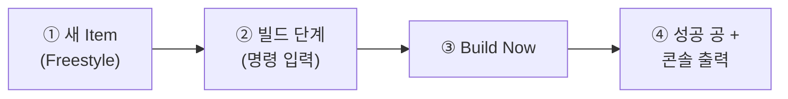

# 🟧 Jenkins · 2단계 — 첫 Job & 첫 빌드

> 🎯 **개요** — 진짜 Unity 빌드는 5단계에서 합니다. 먼저 **아주 간단한 명령**으로 "빌드 한 번"을 성공시켜, Jenkins가 어떻게 일하는지 몸으로 익힙니다. 첫 **성공 공**을 띄워봐요.

<div class="scenario">
<span class="who">🎬 상황 · 작동 원리부터 안전하게</span>
<ul>
<li>Jenkins의 핵심은 단순합니다 — <b>"시킨 명령을 대신 실행하고, 결과를 보여준다."</b></li>
<li>Unity는 무거우니, 먼저 <b>한 줄짜리 명령</b>으로 그 원리를 확인합니다.</li>
<li>여기서 'Job 만들기 → 빌드 → 결과 보기' 흐름을 익히면, Unity는 명령만 바꾸면 됩니다.</li>
</ul>
</div>

📍 [← 1단계](Step1.md) · [3단계 →](Step3.md)

---

## Job = "이렇게 빌드해라" 설정 한 묶음



## A. 새 Job 만들기

1. 대시보드 좌측 위 **`+ 새로운 Item`**(New Item) 클릭
2. 이름에 **`pixel-dungeon-build`** 입력
3. 종류는 **`Freestyle project`**(프리스타일 프로젝트) 선택 → `OK`

> 🙋 **왜 Freestyle?** 가장 쉽고 자유로운 작업 유형이라 초보에게 딱입니다. (`Pipeline`은 코드(Groovy)로 짜는 고급 방식이라 지금은 넘어갑니다.)

## B. 빌드 단계(명령) 추가

설정 화면이 길게 뜨는데, 지금 만질 곳은 **딱 하나**입니다.

1. 아래로 스크롤 → **`Build Steps`**(빌드) 영역
2. **`Add build step`**(빌드 단계 추가) → **`Execute Windows batch command`**(Windows 배치 명령 실행) 선택
3. 까만 입력칸에 아래를 붙여넣기:
   ```bat
   echo Pixel Dungeon 빌드 시작!
   echo 빌드 완료 :) > result.txt
   ```
4. 맨 아래 **`Save`**(저장)

> 🙋 Mac/Linux에서 한다면 `Execute Windows batch command` 대신 **`Execute shell`**을 고르고 `echo` 명령을 넣으면 됩니다.

## C. 빌드 실행 & 결과 보기

1. Job 화면 좌측 **`Build Now`**(지금 빌드) 클릭
2. 좌측 아래 **`Build History`**(빌드 기록)에 **`#1`**이 생기고, 잠깐 깜빡이다 **색깔 공**이 뜹니다 → 파랑(또는 초록)이면 **성공!**
3. **`#1`** 클릭 → **`Console Output`**(콘솔 출력) 클릭 → 내가 echo한 글자와 맨 아래 **`Finished: SUCCESS`**가 보입니다

🎉 사람이 직접 명령 친 게 아니라, **Jenkins가 대신 실행**한 겁니다. 이게 자동화의 출발점이에요.

> 🙋 **이게 빌드라고요?** 네 — 지금은 "명령 실행"만 했지만, 5단계에서 이 한 줄을 **Unity 빌드 명령**으로 바꾸면 진짜 게임 `.exe`가 나옵니다. 틀은 똑같아요.

---

## 🎮 현장 감각 — 게임 PM은 이렇게

> **Pixel Dungeon 맥락**<br>
> "버튼 한 번 = 정해진 작업이 그대로 실행"되는 걸 확인한 게 핵심입니다.<br>
> 사람이 매번 같은 절차를 손으로 하면 실수가 생기지만, Jenkins는 **항상 똑같이** 합니다.<br>
> 이 '재현성'이 바로 팀이 CI를 쓰는 이유예요 — "내 PC에선 됐는데"가 사라집니다.

**⚠️ 흔한 실수**
- Job 종류를 `Pipeline`으로 고름 → 지금은 **`Freestyle project`**.
- 빌드 단계를 안 넣고 저장 → `Build Now`는 되지만 아무 일도 안 함. **Execute Windows batch command**를 꼭 추가.

**🎤 면접 한 줄**
> *"Jenkins **Freestyle Job**을 만들어 빌드 단계를 정의하고, **Build Now**로 실행해 성공까지 확인했습니다."*

---

## ✅ 확인

- [ ] `pixel-dungeon-build` Freestyle Job을 만들었다
- [ ] 빌드 단계(echo)를 넣고 **Build Now**로 **성공 공**을 띄웠다
- [ ] **Console Output**에서 내가 적은 글자와 `Finished: SUCCESS`를 봤다

---

👉 다음: **[3단계 · 빌드 읽기](Step3.md)**
