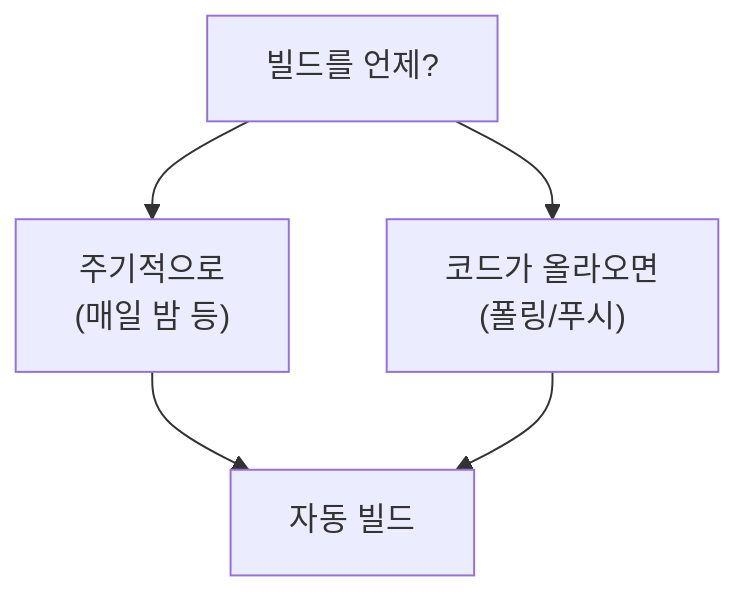

# 🟧 Jenkins · 6단계 — 자동 트리거 (사람이 안 눌러도)

> 🎯 **개요** — 지금까진 **Build Now**를 사람이 눌렀죠. 이제 "**언제** 빌드할지"를 정해, 사람이 없어도 알아서 돌게 합니다. 이게 진짜 "자동" 빌드예요.

🎬 상황 · 아침마다 최신 빌드가 준비돼 있다
<ul>
<li>QA가 매일 아침 최신 빌드로 테스트를 시작하고 싶어 합니다.</li>
<li>매일 밤 자동으로 빌드해두면, 아침엔 늘 <b>'어제까지의 최신 빌드'</b>가 기다리고 있어요.</li>
<li>사람이 깨어 있지 않아도 도는 것 — 그게 자동화의 핵심입니다.</li>
</ul>

📍 [← 5단계](Step5.md) · [7단계 →](Step7.md)

---

## A. 빌드 유발(Build Triggers)이란

Job → **`구성`(Configure)** → **`빌드 유발`(Build Triggers)** 섹션에서 "언제 빌드할지"를 고릅니다. 크게 두 가지를 배워요:

## B. 방법 1 — 주기적으로 (가장 쉬움)

1. **`Build periodically`**(주기적으로 빌드) 체크
2. 스케줄 칸에 **cron** 형식으로 시간 입력. 예:
   - `H 2 * * *` → **매일 새벽 2시쯤** (야간 빌드)
   - `H/30 * * * *` → **30분마다**
   - `H 9 * * 1-5` → **평일 오전 9시쯤**
3. `Save`

**cron 5칸 읽는 법** — `분 시 일 월 요일` 순서입니다:

| 칸 | 뜻 | 예 |
|---|---|---|
| 1 | 분(0~59) | `H` = 알아서 |
| 2 | 시(0~23) | `2` = 새벽 2시 |
| 3 | 일(1~31) | `*` = 매일 |
| 4 | 월(1~12) | `*` = 매월 |
| 5 | 요일(0~7) | `1-5` = 월~금 |

> 🙋 **`H`가 뭐예요?** "Hash"의 약자로, **Jenkins가 시간을 알아서 살짝 흩어주는** 표시입니다. 모두가 정각 0분에 몰리면 서버가 버거우니, `H 2 * * *`라고 쓰면 새벽 2시 **언저리**의 적당한 분에 돌려줍니다.

## C. 방법 2 — 코드가 올라오면 (폴링)

팀이 Git을 쓴다면, **저장소를 주기적으로 확인**해 변경이 있을 때만 빌드할 수 있어요.

- **`Poll SCM`**(SCM 폴링) 체크 → `H/5 * * * *` (5분마다 변경 확인)
- 변경이 있으면 빌드, 없으면 건너뜀 → 쓸데없는 빌드를 줄여줍니다

> 🔸 진짜 CI는 "push하는 **즉시** 빌드"입니다(폴링보다 빠름). 그 방식(webhook)은 **9단계**에서 맛봅니다. 지금은 Git 연결 전이라 **방법 1(주기)**로 자동화를 체험하면 충분해요.

## D. 자동으로 도는지 확인하기

1. 잠깐 테스트로 **`H/2 * * * *`**(2분마다)를 걸고 `Save`
2. 2~4분 기다리면 — **아무도 안 눌렀는데** `Build History`에 `#N`이 새로 쌓입니다 🎉
3. 확인했으면 다시 **야간(`H 2 * * *`)** 등 현실적인 주기로 바꿔두기

> 🙋 테스트 주기를 그대로 두면 PC가 계속 빌드하느라 바빠집니다. **확인 후 꼭 야간/필요 주기로 변경**하세요.

---

## 🎮 현장 감각 — 게임 PM은 이렇게

> **Pixel Dungeon 맥락** 
> 매일 밤 도는 빌드를 **'나이트리 빌드(nightly build)'**라고 부르며, 업계 표준입니다. 
> 덕분에 QA는 아침마다 '어제까지의 모든 변경이 반영된 빌드'로 바로 테스트를 시작합니다. 
> PM에겐 "진행 상황이 매일 **실제 돌아가는 빌드**로 증명된다"는 뜻 — 말이 아니라 결과물로요.

**⚠️ 흔한 실수**
- cron을 5칸이 아닌 형식으로 씀 → **`분 시 일 월 요일`** 5칸.
- 테스트 주기(2분)를 안 바꿈 → PC가 쉴 새 없이 빌드. 확인 후 **원래 주기로**.

**🎤 면접 한 줄**
> *"**주기적 트리거(나이트리 빌드)**를 걸어 사람 개입 없이 매일 최신 빌드가 생성되도록 했고, QA가 항상 최신본으로 테스트하게 만들었습니다."*

---

## ✅ 확인

- [ ] `Build periodically`로 빌드 주기를 설정했다
- [ ] cron 5칸(`분 시 일 월 요일`)의 의미를 말할 수 있다
- [ ] 짧은 주기로 테스트해 **사람이 안 눌러도** 빌드가 쌓이는 걸 확인했다

---

👉 다음: **[7단계 · 산출물 보관·전달](Step7.md)**
