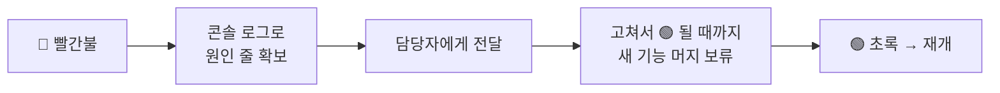

# 🟧 Jenkins · 8단계 — 깨진 빌드 대응 & 가시성

> 🎯 **개요** — 자동 빌드의 진짜 가치는 **"깨지면 빨리 알려주는 것"**입니다. 누가·어떻게 알게 할지, 빨간불일 때 팀이 무엇을 멈춰야 하는지를 PM·QA 관점에서 익힙니다.

🎬 상황 · 아무도 모른 빨간불
<ul>
<li>밤사이 빌드가 빨간불이 됐는데 아무도 몰랐습니다.</li>
<li>아침에 QA가 <b>깨진 빌드</b>를 받아 반나절 테스트하다 "어 빌드가 안 켜져요?"</li>
<li>깨지면 <b>즉시 알리고, 그것부터 고치는</b> 규율이 반나절을 살립니다.</li>
</ul>

📍 [← 7단계](Step7.md) · [9단계 →](Step9.md)

---

## A. "빌드 깨짐" = 팀의 빨간 신호등

빌드가 빨간 공이라는 건 **"지금 메인 코드가 빌드되지 않는다"**는 뜻입니다. 이 위에 새 기능을 더 쌓으면 원인이 뒤섞여 더 찾기 어려워져요. 그래서 업계 규칙:

> 🔸 **"빌드가 깨지면, 그것부터 고친다 (Stop the line)."** 빨간불에선 새 기능 머지를 멈추고, 초록으로 되돌리는 게 1순위입니다.

## B. 알림(Notification) — 깨지면 자동으로 알리기

빨간불을 **사람이 우연히 발견**하면 늦습니다. 실패하면 자동으로 알리게 합니다.

- Job → `구성` → **`빌드 후 조치`** → **`E-mail Notification`**(이메일 알림) → 받는 주소 입력
- 회사 메일서버(SMTP) 연결은 관리자가 **`Manage Jenkins ▸ System`**에서 한 번 설정
- 요즘은 **Slack/Discord 플러그인**으로 팀 채널에 알리는 방식이 더 흔합니다

> 🙋 **수업 환경**에선 메일서버가 없을 수 있어요. 여기서 목표는 **"어디서 켜는지 + 왜 필요한지"**를 아는 것입니다. 실제 SMTP 설정은 관리자 영역이라 몰라도 괜찮아요. (PM은 "실패 알림이 걸려 있나?"를 챙기는 사람이면 충분합니다.)

## C. 한눈에 보는 대시보드

Jenkins 메인 화면은 **모든 Job의 공 색깔·날씨**가 한판에 보입니다. 사무실 모니터에 띄워두면 팀 전체가 **빨강을 즉시** 인지해요.

- **빌드 상태 배지(badge)** — 저장소 README에 "build: passing/failing" 뱃지를 붙여, 코드 보러 온 사람이 바로 상태를 알게 하는 방식도 흔합니다(개념만).

## D. PM·QA의 "깨진 빌드" 플레이북

- **PM**: 코드를 못 고쳐도, "언제부터·무엇이 원인인지"를 로그로 짚어 담당자에게 넘기고, 초록 될 때까지 머지 규율을 잡습니다.
- **QA**: **빨간 빌드는 테스트하지 않습니다**(시간 낭비). 초록 빌드만 받아 테스트해요.

---

## 🎮 현장 감각 — 게임 PM은 이렇게

> **Pixel Dungeon 맥락** 
> CI의 진짜 효용은 문제를 **'몇 주 뒤'가 아니라 '몇 분 뒤'**에 발견하는 것입니다. 
> "빌드 초록 유지"를 팀 규율로 만들면, 출시 직전에 터지는 대형 사고가 크게 줄어요. 
> PM은 기능 속도만이 아니라 **'초록불을 지키는 것'도 일정 관리**라는 걸 압니다.

**⚠️ 흔한 실수**
- 빨강을 방치하고 계속 개발 → 나중에 원인들이 뒤섞여 **수습 비용 폭증**.
- 알림을 안 걸어 **아무도 모름** → 자동 빌드의 의미가 절반으로.

**🎤 면접 한 줄**
> *"빌드 실패 **알림과 대시보드**로 문제를 빠르게 인지하고, **'빌드 깨지면 머지 중단'** 규율로 초록 상태를 지키는 흐름을 만들었습니다."*

---

## ✅ 확인

- [ ] "빌드 깨짐 = 새 기능 머지 보류"의 이유를 설명할 수 있다
- [ ] 실패 알림을 **어디서** 켜는지(빌드 후 조치/관리자 SMTP) 안다
- [ ] 빨간불 대응 순서(로그→전달→보류→재개)를 말할 수 있다

---

👉 다음: **[9단계 · Git 연동 & 마무리](Step9.md)**
