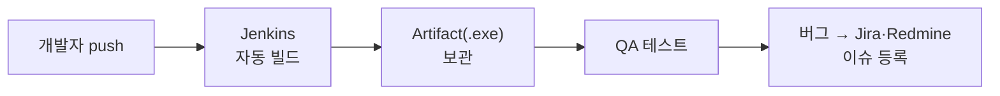

# 🟧 Jenkins · 9단계 — Git 연동 & 마무리

> 🎯 **개요** — 마지막입니다. **"코드를 push하면 즉시 빌드"**라는 진짜 CI를 살짝 맛보고, 우리가 만든 자동 빌드를 **QA 프로세스와 연결**하며 트랙을 마무리합니다.

🎬 상황 · 완성된 자동 파이프라인
<ul>
<li>이제 개발자가 GitHub에 코드를 올리면, Jenkins가 알아서 빌드하고 QA가 받습니다.</li>
<li>사람이 끼어들 곳이 없는 <b>완전한 자동 흐름</b>이 됩니다.</li>
<li>여기까지 오면, "빌드 자동화를 직접 만들어 봤다"고 자신 있게 말할 수 있어요.</li>
</ul>

📍 [← 8단계](Step8.md) · [직접 해보기 →](Practice.md)

---

## A. Git 연동 맛보기 (선택)

지금까진 내 PC의 폴더를 빌드했죠. 팀이 **GitHub**를 쓴다면, Jenkins가 저장소에서 코드를 받아 빌드하게 할 수 있어요.

1. Job → `구성` → **`소스 코드 관리`(Source Code Management)** → **`Git`** 선택
2. **`Repository URL`**에 저장소 주소 입력 (공개 저장소면 인증 없이 됩니다)
3. **`빌드 유발`** → **`GitHub hook trigger`**(푸시 즉시) 또는 6단계의 **`Poll SCM`**(주기 확인)
4. 이제 누군가 **push하면 → Jenkins가 자동 빌드** → 7단계 Artifact로 QA에게

> 🙋 **비공개 저장소**는 로그인 정보(크리덴셜)가 필요해 관리 영역으로 넘어갑니다. 수업에선 **공개 저장소로 "push→빌드"의 개념**만 확인하면 충분해요. 자세한 webhook 설정은 9단계 끝의 공식 문서를 참고하세요.

## B. 우리가 만든 파이프라인 전체 그림

이게 바로 **CI/CD의 '빌드 자동화' 칸**입니다. 앞에서 정리했던 `커밋 → 빌드 → 테스트 → 배포` 중 **빌드 부분을 직접 완성**한 거예요.

## C. QA 프로세스와 연결

빌드 자동화는 **QA의 출발선을 매번 새로 깔아주는 일**입니다.

- Jenkins가 만든 빌드를 → QA가 받아 테스트 →
- 버그는 **Jira/Redmine에 빌드 번호(#27)와 함께** 등록 (다른 트랙과 이어지는 지점!) →
- 고치면 다시 빌드 → 다시 QA

> 🔸 즉 Jenkins는 **할 일 관리 툴(Jira·Asana·Trello·Redmine)을 대체하지 않습니다.** 그 옆에서 "빌드를 책임지는" **보완 도구**예요. 둘은 함께 굴러갑니다.

## D. Jenkins의 한계 (정직하게)

- **내가 유지보수해야 함** — 자체 호스팅이라 서버·업데이트·플러그인을 직접 관리.
- **Unity 빌드는 무겁다** — 빌드 시간이 길고 디스크를 많이 씁니다. iOS 빌드는 **Mac**이 따로 필요.
- 그래서 팀이 커지면 **GitHub Actions·Unity Build Automation** 같은 *호스팅* CI도 함께 검토합니다. (설치·라이선스 부담이 적어요.)

> 💡 그래도 **"내 PC에 깔린 Unity로 자동 빌드를 직접 세워 봤다"**는 경험은, CI/CD가 *실제로 어떻게 도는지*를 몸으로 이해했다는 강력한 증거가 됩니다.

---

## 🎮 현장 감각 — 게임 PM은 이렇게

> **Pixel Dungeon 맥락** 
> 빌드가 자동·반복 가능해지면, 팀은 "빌드 만드느라" 쓰던 시간을 **만드는 일**에 씁니다. 
> PM은 빌드를 특정 개인에서 떼어내 **팀의 인프라**로 만든 셈 — 일정 리스크가 하나 줄었습니다. 
> "왜 CI가 필요한가"를 도구·비용·문화 관점에서 설명할 수 있다면, 비전공 PM으로서 큰 강점입니다.

**🎤 면접 한 줄(트랙 종합)**
> *"Jenkins를 직접 설치해 **Unity 자동 빌드 파이프라인**(빌드→산출물 보관→QA 전달)을 만들고, **push→빌드** 연동과 **깨진 빌드 대응 규율**까지 구성했습니다. CI/CD의 필요성과 한계를 PM 관점에서 설명할 수 있습니다."*

---

## ✅ 확인

- [ ] (선택) Git 저장소를 연결해 "push→빌드" 개념을 확인했다
- [ ] 빌드 자동화가 **QA·이슈 관리와 어떻게 이어지는지** 말할 수 있다
- [ ] Jenkins의 장점과 한계(자체 호스팅·유지보수·호스팅 대안)를 안다

---

## ➡️ 다음

🎓 **트랙은 순서가 없어요** — Jira·Asana·Trello·Redmine은 '할 일 관리' 툴이고, **Jenkins는 거기에 더해지는 '빌드 자동화' 도구**예요. 무엇이든 끌리는 걸 골라 보세요. 내게 맞는 툴 고르기 → **[툴 선택 가이드](../05_Capstone/Capstone.md)** · 직접 만들어보기 → **[Jenkins 직접 해보기](Practice.md)**
